# Gmail MCP Server - Multi-User Architecture Diagram

## Docker Deployment with Multi-User Session Isolation

```mermaid
graph TB
    subgraph "Docker Container"
        subgraph "Gmail MCP Server"
            HTTP[HTTP Server :3006]
            AUTH1[Auth Server :3000]
            AUTH2[Auth Server :3456]
            
            subgraph "Session Manager"
                SM[SessionAwareTransportManager]
            end
            
            subgraph "User1 Session"
                S1[Session: abc-123]
                MCP1[MCP Server Instance 1]
                T1[Transport 1]
                ALS1[AsyncLocalStorage Context 1]
            end
            
            subgraph "User2 Session"
                S2[Session: def-456]
                MCP2[MCP Server Instance 2]
                T2[Transport 2]
                ALS2[AsyncLocalStorage Context 2]
            end
            
            subgraph "User3 Session"
                S3[Session: ghi-789]
                MCP3[MCP Server Instance 3]
                T3[Transport 3]
                ALS3[AsyncLocalStorage Context 3]
            end
        end
    end
    
    subgraph "External Users"
        U1[👤 User1<br/>MCP Client]
        U2[👤 User2<br/>MCP Client]
        U3[👤 User3<br/>MCP Client]
    end
    
    subgraph "Google Services"
        GMAIL[📧 Gmail API]
        GAUTH[🔐 Google OAuth2]
    end
    
    subgraph "Port Mapping"
        P3006[":3006 → MCP HTTP"]
        P3000[":3000 → Auth Callback"]
        P3456[":3456 → Auth Callback"]
    end
    
    %% User Connections
    U1 ---|1. POST /mcp initialize| HTTP
    U2 ---|1. POST /mcp initialize| HTTP
    U3 ---|1. POST /mcp initialize| HTTP
    
    %% Session Creation
    HTTP ---|2. Create Session| SM
    SM ---|3a. New Session abc-123| S1
    SM ---|3b. New Session def-456| S2
    SM ---|3c. New Session ghi-789| S3
    
    %% MCP Server Instances
    S1 ---|4a. Isolated Server| MCP1
    S2 ---|4b. Isolated Server| MCP2
    S3 ---|4c. Isolated Server| MCP3
    
    %% Transport Connections
    MCP1 ---|5a. Connect| T1
    MCP2 ---|5b. Connect| T2
    MCP3 ---|5c. Connect| T3
    
    %% Context Isolation
    T1 ---|6a. Context| ALS1
    T2 ---|6b. Context| ALS2
    T3 ---|6c. Context| ALS3
    
    %% Request Flow
    U1 ---|7a. mcp-session-id: abc-123| HTTP
    U2 ---|7b. mcp-session-id: def-456| HTTP
    U3 ---|7c. mcp-session-id: ghi-789| HTTP
    
    HTTP ---|8a. Route to Session| S1
    HTTP ---|8b. Route to Session| S2
    HTTP ---|8c. Route to Session| S3
    
    %% Response Flow
    S1 ---|9a. Response| U1
    S2 ---|9b. Response| U2
    S3 ---|9c. Response| U3
    
    %% Authentication Flow
    U1 ---|OAuth Callback| AUTH1
    U2 ---|OAuth Callback| AUTH2
    U3 ---|OAuth Callback| AUTH1
    
    AUTH1 ---|Auth Request| GAUTH
    AUTH2 ---|Auth Request| GAUTH
    
    %% Gmail API Access
    MCP1 ---|Gmail Operations| GMAIL
    MCP2 ---|Gmail Operations| GMAIL
    MCP3 ---|Gmail Operations| GMAIL
    
    %% Styling
    classDef userClass fill:#e1f5fe,stroke:#01579b,stroke-width:2px
    classDef sessionClass fill:#f3e5f5,stroke:#4a148c,stroke-width:2px
    classDef serverClass fill:#e8f5e8,stroke:#1b5e20,stroke-width:2px
    classDef authClass fill:#fff3e0,stroke:#e65100,stroke-width:2px
    classDef googleClass fill:#ffebee,stroke:#c62828,stroke-width:2px
    
    class U1,U2,U3 userClass
    class S1,S2,S3,MCP1,MCP2,MCP3,T1,T2,T3,ALS1,ALS2,ALS3 sessionClass
    class HTTP,SM serverClass
    class AUTH1,AUTH2 authClass
    class GMAIL,GAUTH googleClass
```



## Key Architecture Features

### 🔒 **Complete Session Isolation**
- Each user gets a dedicated `SessionTransportData` with isolated MCP server instance
- Independent `AsyncLocalStorage` context per session prevents cross-user interference
- Session ID correlation ensures responses reach the correct user

### 🌐 **Multi-Port Authentication**
- **Port 3006**: Main MCP HTTP endpoint for all users
- **Port 3000**: Primary OAuth2 callback for Google authentication
- **Port 3456**: Secondary OAuth2 callback for additional users
- Flexible callback URL configuration for different user flows

### 📊 **Session Management**
- `SessionAwareTransportManager` handles session lifecycle
- Automatic cleanup of inactive sessions (1 hour timeout)
- Real-time session monitoring via `/health` and `/sessions` endpoints

### 🔄 **Request-Response Flow**
1. **Initialization**: User sends `initialize` request → Creates isolated session
2. **Session Creation**: Dedicated MCP server instance + transport + context
3. **Request Processing**: Session ID header routes to correct isolated environment
4. **Response Delivery**: AsyncLocalStorage ensures response reaches original user
5. **Context Preservation**: Maintained throughout entire async operation chain

### 🚀 **Deployment Configuration**

```bash
# Docker deployment with multi-user support
docker run -d \
  -p 3006:3006 \
  -p 3000:3000 \
  -p 3456:3456 \
  -v gmail-mcp-data:/app/data \
  -e NODE_ENV=production \
  gmail-mcp-server:latest --http

# Health monitoring
curl http://localhost:3006/health
curl http://localhost:3006/sessions
```

This architecture ensures zero response routing conflicts and complete user isolation in multi-user Docker deployments.